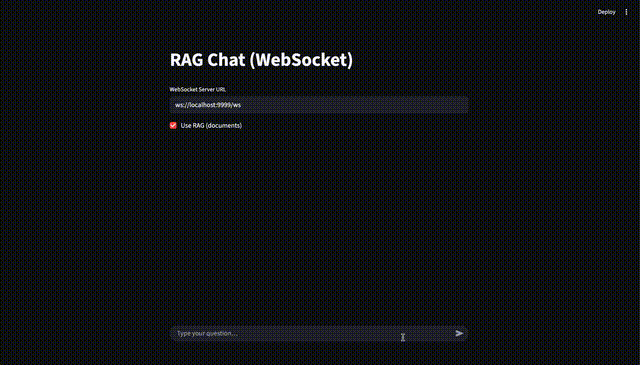

# MultimodalRAG 🚀
MultimodalRAG is an advanced Retrieval-Augmented Generation (RAG) system capable of understanding and processing complex documents containing text, tables, and images. This project uses a sophisticated pipeline to ingest documents, create multi-modal embeddings, and provide a real-time chat interface for querying the knowledge base.

The backend is built with FastAPI and communicates over WebSockets, while the interactive user interface is created with Streamlit. Vector storage and search are powered by Qdrant.

## 🎥 Demo

<p align="center">
  
</p>

## ✨ Features
- **Multi-Modal Ingestion**: Parses PDFs to extract and understand paragraphs, tables, and figures.  
- **Hybrid Vector Search**: Uses separate embedding models for text (`BAAI/bge-m3`) and images (`google/siglip-base-patch16-224`) for specialized understanding.  
- **Unified Ranking**: Employs **Reciprocal Rank Fusion (RRF)** and a **Cross-Encoder** (`BAAI/bge-reranker-v2-m3`) to intelligently fuse and rerank search results from all modalities.  
- **Dynamic Visual Boost**: Automatically detects visual intent in queries to promote relevant images and diagrams.  
- **Interactive Chat UI**: A user-friendly interface built with **Streamlit** to chat with your documents.  
- **Asynchronous Backend**: A robust **FastAPI** server with WebSocket support for real-time communication.  


## 🛠️ Setup and Installation
Follow these steps to set up and run the project locally.

### Prerequisites
- Python >= 3.12
- Docker and Docker Compose
- Git

### 1. Clone the Repository
```bash
git clone https://github.com/YOUR_USERNAME/MultimodalRAG.git
cd MultimodalRAG
```

### 2. Start Qdrant Vector Database
This project uses a Docker container for Qdrant. Run the following command to start the service:

```bash
docker run -p 6333:6333 -p 6334:6334 \
    -v $(pwd)/qdrant_storage:/qdrant/storage \
    qdrant/qdrant
```

This command starts Qdrant and maps its storage to a local folder to persist your data.

### 3. Install System Dependencies (pdfinfo)
The `unstructured` library requires `poppler` (which includes `pdfinfo`) to correctly process PDFs.

macOS (using Homebrew):
```
brew install poppler
```

Ubuntu/Debian:
```
sudo apt-get update && sudo apt-get install -y poppler-utils
```

### 4. Set Up Python Environment
Create and activate a virtual environment, then install the required packages.

```
python3 -m venv venv

source venv/bin/activate

pip install -r requirements.txt
```

### 5. Configure Environment Variables
Copy .env.example to .env and update the values.
Example .env file:

```bash
export OPENAI_API_KEY="YOUR_OPENAI_API_KEY"
export DATA_DIR="./data"
```


## 🚀 Usage
The application requires a two step process: first ingest the data, then run the apps.

### 1. Ingest the Knowledge Base
Before running the main application, you must process the source document and load it into Qdrant.

```bash
python doc_processing.py
```
**Note:** the `figures/` dir will have the images from the document extracted once you ingest the document.

This script will parse data/KB_document1.pdf, generate embeddings, and store them in your Qdrant instance. Any extracted figures will be saved in the figures/ directory.

### 2. Run the Backend (FastAPI)
Use the provided shell script to run the FastAPI server.

```bash
chmod +x devrun.sh #you only need to run this once

./devrun.sh
```

The backend will be available at `http://localhost:9999`.

### 3. Run the Frontend (Streamlit)
In a new terminal window, activate the virtual environment again and run the Streamlit UI.

```bash
source venv/bin/activate
streamlit run client_ui.py
```

Open your browser to the URL provided by Streamlit (usually `http://localhost:8501`) to start chatting with the document!


